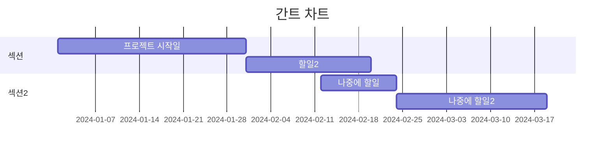

---
cssclasses:
---
---

startdate: 2024-05-14

duedate: 2024-05-1

---



```dataviewjs

const now = new Date();

const startOfWeek = new Date(now.setDate(now.getDate() - now.getDay() + (now.getDay() === 0 ? -6 : 1)));

const endOfWeek = new Date(startOfWeek);

endOfWeek.setDate(endOfWeek.getDate() + 6);

const projects = dv.pages('"./"')

.where(p => p.duedate && (p.startdate <= endOfWeek && p.duedate >= startOfWeek))

.sort(p => p.duedate, 'desc');

const mermaidConf = `mermaid

gantt

dateFormat D-M-YYYY

axisFormat %m-%d

todaymarker on`;

let tasks = "";

projects.forEach(page => {

const title = page.file.name;

const startDate = page.startdate ? `${page.startdate.day}-${page.startdate.month}-${page.startdate.year}` : 'unknown';

const dueDate = page.duedate ? `${page.duedate.day}-${page.duedate.month}-${page.duedate.year}` : 'unknown';

tasks += ` ${title} : ${startDate}, ${dueDate}\n`;

});

const backticks = "```";

dv.paragraph(

`${backticks}${mermaidConf}

${tasks}

${backticks}`

);

```
